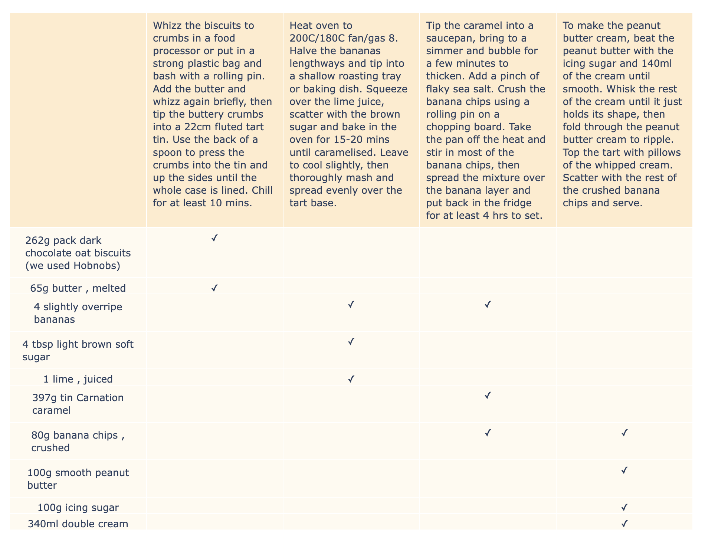

# Recipe Gantt 🧑‍🍳

Recipe Gantt uses an LM to automatically convert recipes like [this one](https://www.bbcgoodfood.com/recipes/next-level-banoffee-pie) 🍌 into gantt charts like the one below:


The hope is to provide a simpler graphical way of viewing recipes (especially complicated multi-step ones) without having to move back and forth between the ingredients and the method inefficiently.

It's very over-engineered.

## Installation

```bash
conda env create -f env.yml 
```

## Usage

First activate the conda environment:

```bash
conda activate recipe-gantt
```

Then you can run the CLI:

```bash
python recipe-gantt.py
```

## Development process

### Data collection

1. Used the [openrecipes](https://github.com/fictivekin/openrecipes) dataset to get a few hundred recipe URLs
1. Used [recipe-scrapers](https://github.com/hhursev/recipe-scrapers) library to extract the ingredients and method steps when given a recipe URL ([code](https://github.com/jbremz/recipe-gantt/blob/1c37b115b155a128e0765040197c5783b5a91ff3/notebooks/001-get-data/02-save-recipes.ipynb)).
1. A custom GPT Assistant was written to generate the desired gantt charts as TSV files (albeit much more slowly and expensively) from simplified Ingredients, Method formatted recipes ([code](https://github.com/jbremz/recipe-gantt/blob/1c37b115b155a128e0765040197c5783b5a91ff3/notebooks/001-get-data/03-query-gpt4.ipynb)).  A publicly accessible GPT version of the same assistant is [here](https://chat.openai.com/g/g-VG5s6fStY-recipe-gantt).
1. Did a small amount of manual tweaking of the outputs to improve data quality before I lost my mind and moved on ([code](https://github.com/jbremz/recipe-gantt/blob/1c37b115b155a128e0765040197c5783b5a91ff3/notebooks/001-get-data/04-check-results.ipynb)).

You can find the dataset hosted here: [pocasrocas/recipe-gantt](https://huggingface.co/datasets/pocasrocas/recipe-gantt).

### Finetuning/implementation

1. Used [axolotl](https://github.com/OpenAccess-AI-Collective/axolotl) finetune Mistral-7B-v0.1 on this dataset of a few hundred examples of (recipe input, gantt chart output) pairs. This model wouldn't need the tedious CoT prompting that I had to use with GPT4 and instead could map directly to the output, making it ~4x quicker. I could also host it locally which was better than paying for GPT4 credits ([code](https://github.com/jbremz/recipe-gantt/tree/002-train/notebooks/002-train)).
1. Made use of [llama.cpp](https://github.com/ggerganov/llama.cpp) and [llama-cpp-python](https://github.com/abetlen/llama-cpp-python) to compress the finetuned model and run it locally on my macbook at ~30tok/s

You can see the wandb training logs [here](https://wandb.ai/pocasrocas/recipe-gantt/runs/1ostj66y/workspace).

The resulting model is hosted here: [pocasrocas/recipe-gantt-v0.1](https://huggingface.co/pocasrocas/recipe-gantt-v0.1). 

## Areas for development

1. It's not pretty, but then frontend isn't really my thing... any PRs to give this a proper UI etc. are very welcome
1. It was surprising to me just how little data was required to produce a good quality model. However, sometimes it produces corrupted TSV files or populates the cells inaccurately. The simplest answer to this would be to scale up the finetuning data from \~100s to e.g. 1000s of samples. This would be very straightforward to do but I didn't feel like spending more than I already had done (\~£20) on OpenAI credits...
1. There are potential more intelligent ways of constraining the model outputs to valid TSV 🤔
1. My alpaca prompting strategy feels inefficient. Given this is a mono-task LM, each prompt is largely the same except from a different input appended to the end. Given enough finetuning data, the model should be able to learn the task without needing the same preamble every time. Perhaps one could start with a model finetuned on the whole prompt and then switch to removing it later. This should save on redundant computation and allow shorter context lengths.
1. The recipe-scrapers library sometimes fails and unfortunately doesn't support all of the recipe websites that I have tried (you can find a list of supported sites [here](https://github.com/hhursev/recipe-scrapers?tab=readme-ov-file#scrapers-available-for)). This could make things frustrating for practical use but I'm not sure if I'm motivated enough to contribute more scrapers to that project. I did play around with learning a mapping from raw HTML to the gantt chart but it would have required a much larger context length and probably a larger finetuning set (due to greater variability in the input).
